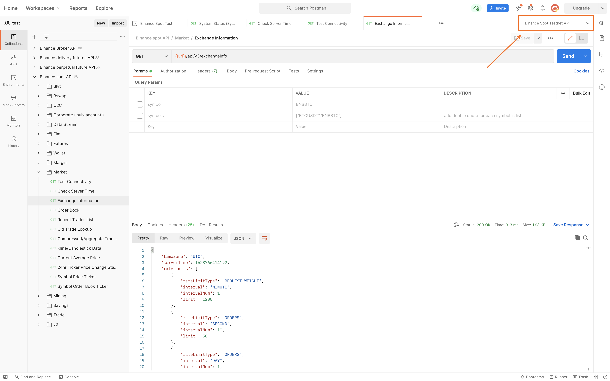

# Binance API Postman

[Postman](https://getpostman.com) is an API Collaboration Platform.

Binance now offers several Postman Collections for quick and easy usage of our RESTful APIs.  
We also provide a Postman environment (JSON configuration file), which can be conveniently imported for use with your own API and secret keys.

## How to import Configuration

- Download the Repository.
- Click the `Import` button. On Postman for Mac, for example, the button is at the top left:
    

- On the `Import` pop-up page, select the `Folder` tab. Click the `Choose folder from your computer` button and choose the root folder of the downloaded repository.
   

- Select which collections and environments you would like to import and click the `Import` button.
   

- Select the `Environments` tab on the left, choose an environment, and set your Api Key and Secret by changing the `Current Value` column (see screenshot); otherwise, Postman will upload your credentials into your personal Postman account. (The `Timestamp`, `Signature`, `Initial Value` fields can be left empty. Postman will fill in `Initial Value` with what you provide in `Current Value`.)
    

    
- Select your newly-added environment from the environment dropdown menu. On Mac, this is at top right, to the left of the5eye icon.
    

## Guide for using the Binance API with Postman
A guide to using the Binance Spot API Postman Collections can be found here:

https://academy.binance.com/economics/binance-api-series-pt-1-spot-trading-with-postman

## Postman safety practices
We suggest that users develop their own applications to work with the Binance Spot API; however, with Postman you can quickly get a feel for each of the API endpoints.

For your safety, please follow these Postman best practices:

- Don't use Collections obtained from an unknown source.
- Review the environment JSON file before use.
- Don't use any code that you don't understand.
- Make sure that the withdrawal permission **is not enabled** for your API keys.
- When you're finished trying out the API, delete your API keys.

## FAQ
### Error: `Could not get any response`
You haven't imported the environment file, or you've imported it but haven't selected it from the dropdown. Please follow the the steps above to import and select the environment in Postman.

### Error: `API-key format invalid.`
Likely causes:
- Your API key is not set.
- Your API key is not correct.
- You have not selected `X-MBX-APIKEY` in your Postman `Headers`.

### Error: `Signature for this request is not valid.`
Likely causes:
- You haven't set your secret key.
- You've selected parameters for which no value was passed. If you aren't using a parameter, uncheck it.
- The parameter `signature` is not at the last of the parameter list.

### Error: `Mandatory parameter 'xxxx' was not sent, was empty/null, or malformed.`
Your request is missing a parameter that the API requires. Please refer to the API documentation, and pass all mandatory parameters in your requests.

### How can I debug a request, or find the URL it uses?
- Open the Postman console `(CMD/CTRL + ALT + C)`. Each request will print out its parameters and URL.
- To debug, edit your `Pre-request` scripts.

## My question isn't here
Please open an issue [here](https://github.com/binance/binance-api-postman/issues).

## License
MIT
