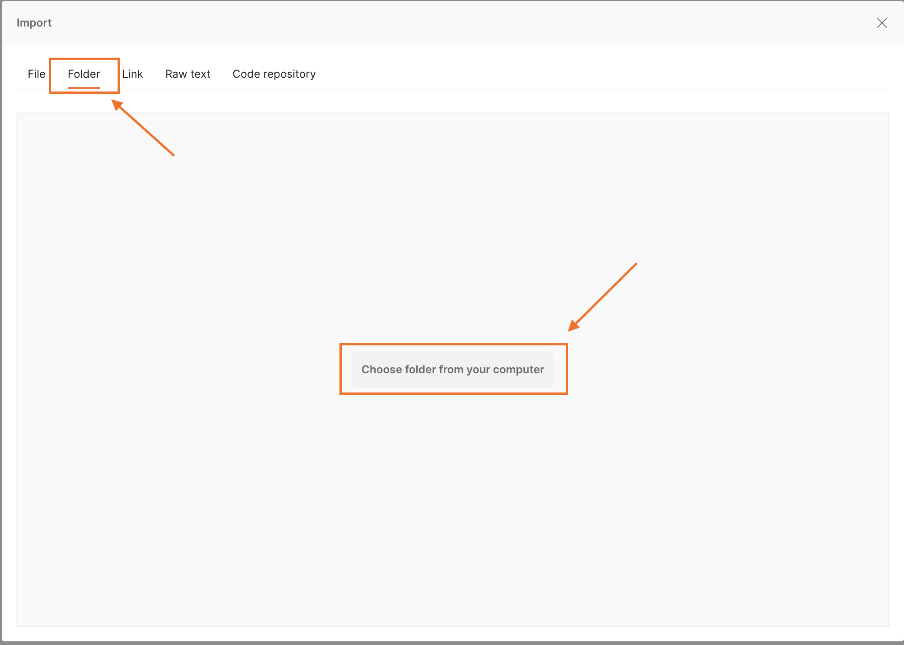

[](https://opensource.org/licenses/MIT)

# Binance API Postman

[Postman](https://getpostman.com) is an API Collaboration Platform.

Binance now offers several Postman Collections and Environments (JSON files) for a quicker and easier usage of our RESTful APIs.<br/>
You only need to import and set up with your own API and secret keys to begin.

## Table of Contents

- [Repository Overview](#repository-overview)
- [Repository Structure](#repository-structure)
- [Quick Start Workflow](#quick-start-workflow)
- [Available APIs](#available-apis)
- [Authentication Flow](#authentication-flow)
- [How to Import and Configure](#how-to-import-and-configure)
- [Binance Spot API with Postman Tutorial](#binance-spot-api-with-postman-tutorial)
- [Postman Safety Practices](#postman-safety-practices)
- [FAQ](#faq)
- [Support](#support)

## Repository Overview


## Repository Structure

```mermaid
graph LR
    subgraph "Directory Structure"
        ROOT[binance-api-postman/] --> COLL[collections/]
        ROOT --> ENV[environments/]
        ROOT --> ASS[assets/]
        ROOT --> DOC[📄 Documentation Files]

        COLL --> COLL1["Binance Spot API.json"]
        COLL --> COLL2["Binance USDs-M Futures API.json"]
        COLL --> COLL3["Binance Coin-M Futures API.json"]
        COLL --> COLL4["Binance European Options API.json"]
        COLL --> COLL5["Binance Broker API.json"]

        ENV --> SPOT[spot/]
        ENV --> PERP[perpetual_futures/]
        ENV --> DELIV[delivery_futures/]
        ENV --> OPT[european_options/]

        SPOT --> SPOT1[Production Environment]
        SPOT --> SPOT2[Testnet Environment]

        PERP --> PERP1[Production Environment]
        PERP --> PERP2[Testnet Environment]

        DELIV --> DELIV1[Production Environment]
        DELIV --> DELIV2[Testnet Environment]

        OPT --> OPT1[Production Environment]

        ASS --> IMG[Screenshots & Images]
    end

    style ROOT fill:#ff9,stroke:#333,stroke-width:3px
    style COLL fill:#9cf,stroke:#333,stroke-width:2px
    style ENV fill:#9fc,stroke:#333,stroke-width:2px
```



## Quick Start Workflow


## Available APIs


## Authentication Flow

```mermaid
sequenceDiagram
    participant User
    participant Postman
    participant PreScript as Pre-request Script
    participant Binance as Binance API

    User->>Postman: Configure API Key & Secret
    User->>Postman: Select Environment
    User->>Postman: Send Request

    Postman->>PreScript: Execute Pre-request Script
    PreScript->>PreScript: Generate Timestamp
    PreScript->>PreScript: Build Query String
    PreScript->>PreScript: Create HMAC SHA256 Signature
    PreScript->>PreScript: Append Signature to Parameters

    PreScript->>Postman: Return Signed Request
    Postman->>Binance: HTTP Request with Headers
    Note over Postman,Binance: Headers: X-MBX-APIKEY<br/>Parameters: timestamp, signature

    alt Valid Credentials
        Binance->>Postman: 200 OK + Response Data
        Postman->>User: Display Response
    else Invalid API Key
        Binance->>Postman: 401 Unauthorized
        Postman->>User: Error: API-key format invalid
    else Invalid Signature
        Binance->>Postman: 401 Unauthorized
        Postman->>User: Error: Signature not valid
    end

    style PreScript fill:#ff9,stroke:#333,stroke-width:2px
    style Binance fill:#f90,stroke:#333,stroke-width:2px
```

## API Request Lifecycle


## How to import and configure

1. **Download the Repository**
   - Clone or download the `binance-api-postman` repository.

2. **Import into Postman**
   - Click the `Import` button. On Postman for Mac, for example, the button is at the top left:

   <p align="center"></p>

3. **Select Folder**
   - On the `Import` pop-up page, select the `Folder` tab. Click the `Choose folder from your computer` button and choose the root folder of the downloaded repository.

   <p align="center"></p>

4. **Import Collections and Environments**
   - Select which collections and environments you would like to import and click the `Import` button.

   <p align="center"></p>

5. **Configure API Credentials**
   - Select the `Environments` tab on the left, choose an environment, and set your API Key and Secret Key by changing the `Current Value` column (see screenshot).
   - The `Timestamp`, `Signature`, `Initial Value` fields can be left empty as they'll be automatically filled by Postman when sending a request.

   <p align="center"></p>

6. **Select Environment**
   - Select your newly-added environment from the environment dropdown menu. On Mac, this is at top right, to the left of the eye icon.

   <p align="center"></p>

## Collections & Environments Reference

```mermaid
graph TD
    subgraph "Collections → Environments Mapping"
        SPOT[Spot API Collection] -.->|Use with| SPOT_PROD[spot/binance_com_spot_api]
        SPOT -.->|Or test with| SPOT_TEST[spot/binance_com_spot_testnet_api]

        USDS[USDs-M Futures Collection] -.->|Use with| USDS_PROD[perpetual_futures/binance_com_perpetual_futures_api]
        USDS -.->|Or test with| USDS_TEST[perpetual_futures/binance_com_perpetual_futures_testnet_api]

        COINM[Coin-M Futures Collection] -.->|Use with| COINM_PROD[delivery_futures/binance_com_delivery_futures_api]
        COINM -.->|Or test with| COINM_TEST[delivery_futures/binance_com_delivery_futures_testnet_api]

        EOPT[European Options Collection] -.->|Use with| EOPT_PROD[european_options/binance_com_european_options_api]

        BROKER[Broker API Collection] -.->|Use with| SPOT_PROD
    end

    style SPOT fill:#e1f5ff,stroke:#01579b,stroke-width:2px
    style USDS fill:#fff3e0,stroke:#e65100,stroke-width:2px
    style COINM fill:#f3e5f5,stroke:#4a148c,stroke-width:2px
    style EOPT fill:#e8f5e9,stroke:#1b5e20,stroke-width:2px
    style BROKER fill:#fce4ec,stroke:#880e4f,stroke-width:2px
```



## Binance Spot API with Postman Tutorial

For a comprehensive guide on using the Binance Spot API with Postman, visit:
https://academy.binance.com/en/articles/binance-api-series-pt-1-spot-trading-with-postman

## Postman safety practices

```mermaid
graph LR
    subgraph "Security Best Practices"
        A[Security Checklist] --> B[✓ Use Official Collections Only]
        A --> C[✓ Review Environment JSON]
        A --> D[✓ Understand All Code]
        A --> E[✓ Disable Withdrawal Permission]
        A --> F[✓ Delete Keys After Testing]

        B --> B1[Verify Source: github.com/binance]
        C --> C1[Check for Suspicious Scripts]
        D --> D1[Review Pre-request Scripts]
        E --> E1[API Key Settings: Read-Only]
        F --> F1[Regular Key Rotation]
    end

    style A fill:#f99,stroke:#333,stroke-width:3px
    style B fill:#9f9,stroke:#333,stroke-width:2px
    style C fill:#9f9,stroke:#333,stroke-width:2px
    style D fill:#9f9,stroke:#333,stroke-width:2px
    style E fill:#9f9,stroke:#333,stroke-width:2px
    style F fill:#9f9,stroke:#333,stroke-width:2px
```



The following practices are advised to secure your account's safety:

- **Don't use Collections obtained from an unknown source.**
- **Review the environment JSON file before its usage.**
- **Don't use any code that you don't understand.**
- **Make sure that the withdrawal permission is not enabled for your API keys.**
- **When you finish trying out the API, delete your API keys.**

## FAQ

**Q:** Why I can't get any response?

You haven't imported the environment file or you've imported it but haven't selected it from the dropdown menu (mentioned in [How to import and configure](#how-to-import-and-configure))

**Q:** How can I debug a request or find the used URL?

- Open the Postman's console to find requests' parameters and URL.
- Debugging can be done by editing the `Pre-request Script` tab.

**Q:** Error `API-key format invalid.`

Likely causes:
- API key is not set.
- API key is not correct.
- `X-MBX-APIKEY` is not selected in your Postman `Headers` tab.

**Q:** Error `Signature for this request is not valid.`

Likely causes:
- Secret key is not set.
- Request was made with at least one empty parameter.
- `signature` is not the last parameter in the parameters list.

**Q:** Error `Mandatory parameter 'xxxx' was not sent, was empty/null, or malformed.`

Please refer to the API documentation to double check all the mandatory parameters.

## Troubleshooting Flowchart


## Support

### My question isn't here

If you don't find your answer here, please consult https://dev.binance.vision/ for similar questions from the community or open an issue [here](https://github.com/binance/binance-api-postman/issues).

### Additional Resources

```mermaid
graph LR
    Help[Need Help?] --> Docs[📚 Documentation]
    Help --> Community[👥 Community]
    Help --> Issues[🐛 GitHub Issues]

    Docs --> DevVision[dev.binance.vision]
    Docs --> Academy[Binance Academy]
    Docs --> APIDoc[API Documentation]

    Community --> Forum[Binance Community Forum]
    Community --> DevVision

    Issues --> Report[Report Bug]
    Issues --> Feature[Request Feature]
    Issues --> Question[Ask Question]

    style Help fill:#9cf,stroke:#333,stroke-width:3px
    style Docs fill:#cf9,stroke:#333,stroke-width:2px
    style Community fill:#fcf,stroke:#333,stroke-width:2px
    style Issues fill:#ffc,stroke:#333,stroke-width:2px
```



## Version History

See [CHANGELOG.md](CHANGELOG.md) for detailed version history and updates.

## License

This project is licensed under the MIT License - see the [LICENSE](LICENSE) file for details.
