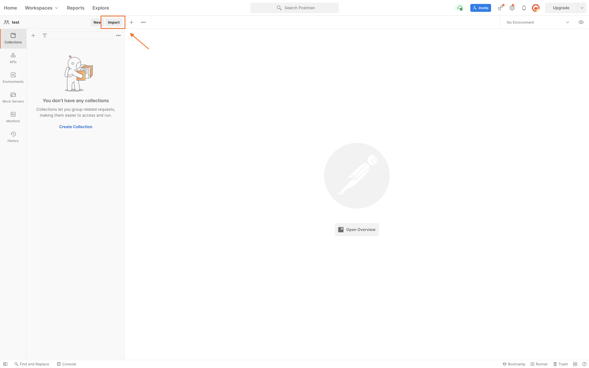
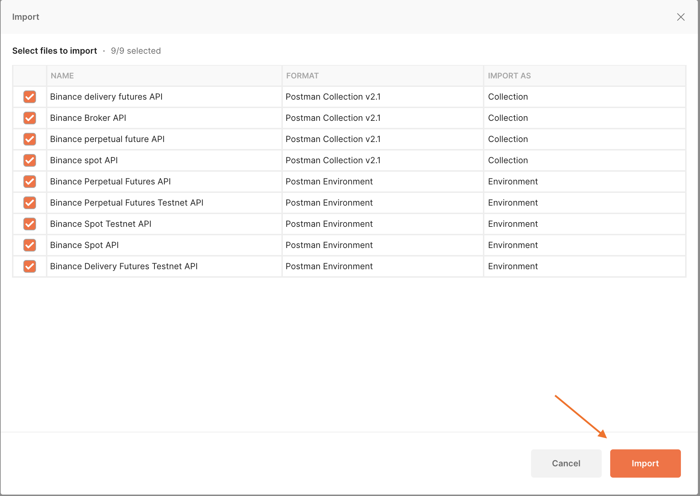
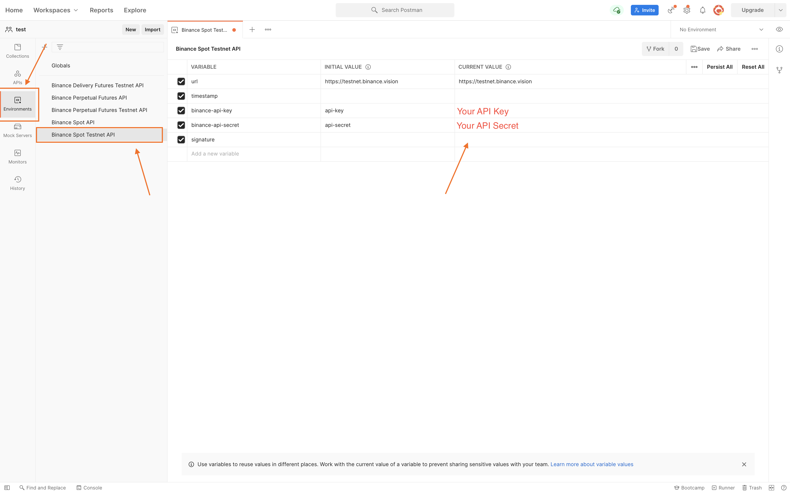

# Binance API Postman

[Postman](https://getpostman.com) is an API Collaboration Platform.

Binance now offers several Postman Collections and Environments (JSON files) for a quicker and easier usage of our RESTful APIs. 
You only need to import and set up with your own API and secret keys to begin.

## How to import and configure

- Download the `binance-api-postman` repository.

- Click the `Import` button. On Postman for Mac, for example, the button is at the top left:
    

- On the `Import` pop-up page, select the root folder of the downloaded repository.
   

- Select which collections and environments you would like to import and click the `Import` button.
   

- Select the `Environments` tab on the left, choose an environment, and set your API and Secret Key by changing the `Current Value` column (see screenshot);
    

- Select your newly-added environment from the environment dropdown menu. On Mac, this is at top right, to the left of the eye icon.
    

## Postman safety practices

The following practices are advised to secure your account's safety:

- Don't use Collections obtained from an unknown source.
- Review the environment JSON file before its usage.
- Don't use any code that you don't understand.
- Make sure that the withdrawal permission **is not enabled** for your API keys.
- When you finish trying out the API, delete your API keys.

## FAQ

**Q:** Why I can't get any response?

You haven't imported the environment file or you've imported it but haven't selected it from the dropdown menu (mentioned in [[How to import and configure]])

**Q:** How can I debug a request or find the used URL?

- Open the Postman's console to find requests' parameters and URL.
- Debugging can be done by editing the `Pre-request Script` tab.

**Q:** Error `API-key format invalid.`

Likely causes:

- API key is not set.
- API key is not correct.
- `X-MBX-APIKEY` is not selected in your Postman `Headers` tab.

**Q:** Error `Signature for this request is not valid.`

Likely causes:

- Secret key is not set.
- Request was made with at least one empty parameter.
- `signature` is not the last parameter in the parameters list.

**Q:** Error `Mandatory parameter 'xxxx' was not sent, was empty/null, or malformed.`

Please refer to the API documentation to double check all the mandatory parameters.

## My question isn't here

If you don't find your answer here, please consult <https://dev.binance.vision/> for similar questions from the community or
open an issue [here](https://github.com/binance/binance-api-postman/issues).
