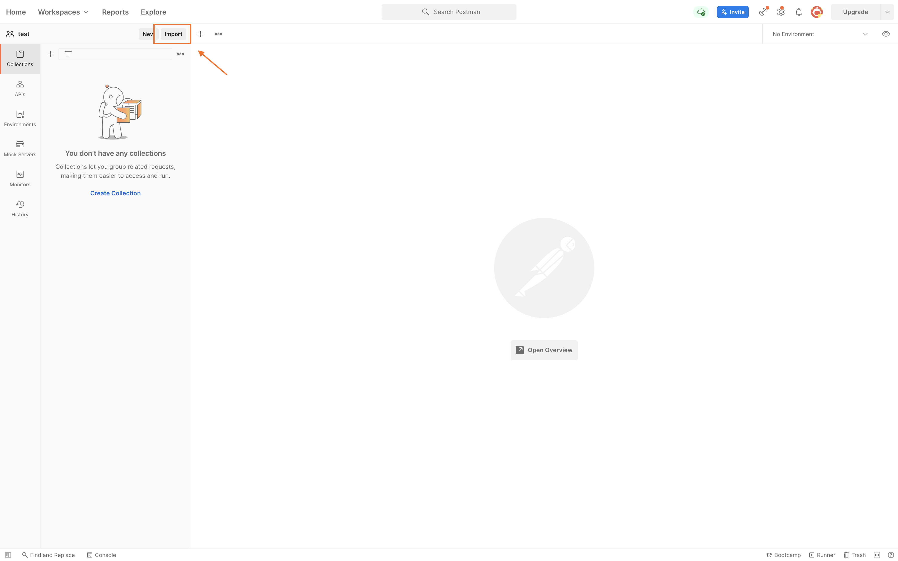
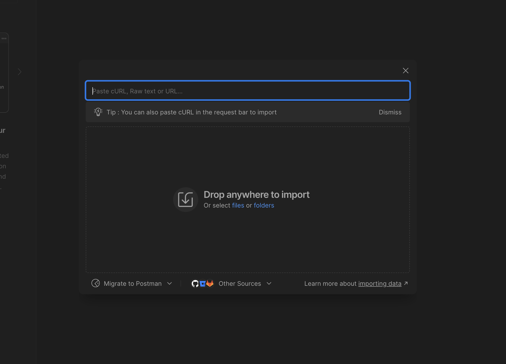
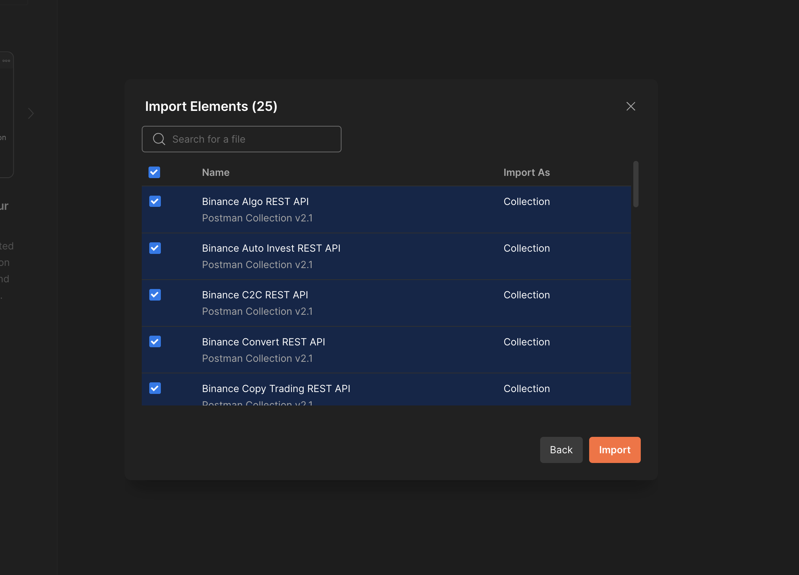
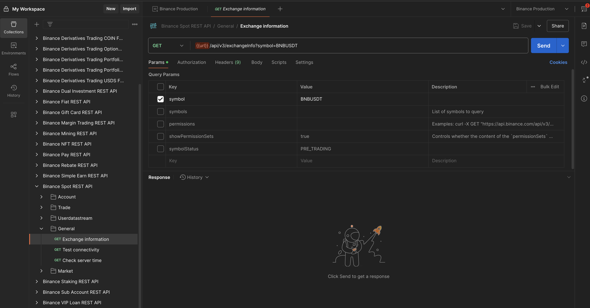

# Binance API Postman
[Postman](https://getpostman.com) 是一个API合作平台。

为了便于用户快速方便的使用RESTful APIs，币安提供几个 Postman Collections 和 Environments 文件（JSON文件)。 
只需要导入并设置自己的API密钥就能即可开始。

## 如何导入和配置
- 下载 `binance-api-postman` 存储库到本地。

- 单击 `Import` 按钮。 例如，在 Mac 版 Postman 上，按钮位于左上角：
    

- 在 `Import` 弹出页面上，选择 `Folder` 选项卡。单击 `Choose folder from your computer` 按钮，然后选择下载存储库的根文件夹。
   

- 选择要导入的 collections 和 environments，然后单击`Import`按钮。
   

- 选择左侧的 `Environments` 选项卡，选择一个 environment，在 `Current Value`的列上设置您的 Api Key 和 Api Secret Key（参见截图)；
（`Timestamp`、`Signature`、`Initial Value` 字段可以留空，它们会在请求时由 Postman 自动填写。）
    

    
- 从环境下拉列表中选择新添加的 environment。在 Mac 上，它位于右上角，眼睛图标的左侧。
    

## 在Postman上使用 Binance Spot API Collection 的教程
https://academy.binance.com/en/articles/binance-api-series-pt-1-spot-trading-with-postman

## Postman 安全实践
为了确保账户安全，建议采取以下最佳安全实践： 

- 不要使用从未知来源获得的 Postman Collections。
- 在使用前要检查好 Environment JSON 文件。
- 不要使用任何你不理解的代码。
- 确保 API 密钥的提款权限**未启用**。
- 使用完 API 端点后，删除所有的 API 密钥。

## 常见问题
**Q:** 为什么我得不到任何回应？

检查是否已导入 environment 设置并从列表中选择对应的environment。请按照上面的步骤设置好你的 environment。

**Q:** 如何debug或者怎么查看请求的URL？

- 在Postman的控制台内能看到每一个请求打印出的参数和URL。
- 可以通过编辑`Pre-request Script`选项卡做调试。

**Q:** 错误 `API-key format invalid.`

有几种可能性:
- 未设置 `API key`。
- `API key`不正确。
- 在Postman`Headers`选项卡中未选择`X-MBX-APIKEY`。

**Q:** 错误 `Signature for this request is not valid.`

有几种可能性:
- 未设置 `Secret key`。
- 选中的参数其中内至少一个参数没有赋值。
- `signature`参数不在参数列表的最后。

**Q:** 错误 `Mandatory parameter 'xxxx' was not sent, was empty/null, or malformed.`

请参阅 API 文档以仔细检查所有必需参数。

## 有疑问
可以在 https://dev.binance.vision/ 中咨询社区类似的问题，或者在此存储库提供 [`issue`](https://github.com/binance/binance-api-postman/issues).
